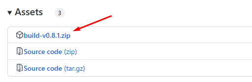
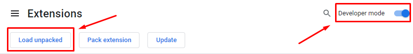
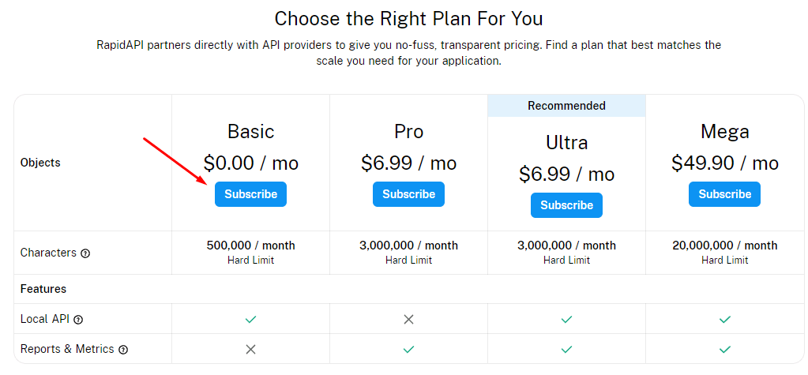
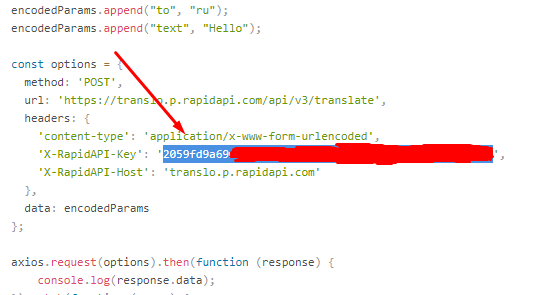
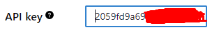

<a name="main"></a>
#  Hint extension

This is a simple extension for Google Chrome browser that can give you hints of what you selected. It automatically detects if it's an equation, a price or it's just a text in a foreign language.

## 💡 It has 3 main features:
- Calculation
- Currency conversion
- Text translation 

Currency rates update once a day and save to cache. Text translations also save to cache up to 300 strings. Caching saves you a lot of requests to the API and boosts result speed. Translation cache can be easily cleared if needed.

## 👓 Demo:


## 🧬 Technologies and API's
- [**Chrome Extension CLI**](https://www.npmjs.com/package/chrome-extension-cli), **WebPack**, **Babel** for building project
- **React JS**, **MobX** **Chakra UI** for menu layout
- **SCSS** for styling
- **Axios** for working with API's
- [**string-math**](https://www.npmjs.com/package/string-math) for calculating
- [**Exchangerate-API**](https://www.exchangerate-api.com/docs/free) for fetching currency rates
- [**CoinGecko API**](https://www.coingecko.com/en/api/documentation) for fetching crypto currency rates
- [**Translo API**](https://rapidapi.com/armangokka/api/translo) from [**RapidAPI hub**](https://rapidapi.com/hub) for translations *([API key required](#getKey))*

<a name="install"></a>
#  Install
1. Go to [releases page](/KirillGoryakin/Hint_Extension/releases) and choose the latest release.
2. Open *assets* dropdown and download *build-vX.X.X.zip* file<br/>
3. Extract this archive anywhere you want to store your extension.
4. Open your Chrome [extension menu](chrome://extensions/). Turn on the "*Developer mode*" and click "*Load unpacked*". Then choose path to your extracted "*build-vX.X.X*" folder.<br/>

That's it! You installed the extension! Remember that for text translation you need an API key. [How to get one?](#getKey)

<a name="dev"></a>
#  Development
Clone repository:
```
git clone https://github.com/KirillGoryakin/Hint_Extension.git
```
Install all packages:
```
npm install
```
Start webpack:
```
npm run watch
```
Then open your Chrome [extension menu](chrome://extensions/). Turn on the "*Developer mode*" and click "*Load unpacked*". Then choose path to your "*build*" folder.<br/>

Production build:
```
npm run build
```

<a name="getKey"></a>
#  How to enable text translation?
This extension uses [**Translo API**](https://rapidapi.com/armangokka/api/translo) for text translation. This API requires an **API key** to work. Don't worry! **It's free** and easy to get! You just need a few actions.

## How to get an **API key**?
1. To obtain one firstly, you need to sign up or log in [**RapidAPI**](https://rapidapi.com/) site.
2. After you sign up go to [Translo API pricing page](https://rapidapi.com/armangokka/api/translo/pricing) and subscribe to **Basic**, free plan.<br/>
3. Then go to [Endpoints page](https://rapidapi.com/armangokka/api/translo) and copy your API key from *Code Snippets* block. Your key should be labeled as "*X-RapidAPI-Key*". Be aware! **Don't copy the quotation marks!**<br/>
4. Then go to the extension option menu and paste your key to the "*API key*" field<br/>

Congrats! You did it! Now you can enable text translation and enjoy! But remember that your translations are limited. 500k characters per month is more than enough, but make sure you don't waste it.

---

This project was bootstrapped with [Chrome Extension CLI](https://github.com/dutiyesh/chrome-extension-cli)

### Icons credits:
- Extension icon by [smashicons.com](https://smashicons.com/)
- API icon by [berkahicon](https://www.flaticon.com/authors/berkahicon).
- Development icon by [Freepik](https://www.flaticon.com/authors/freepik).
- Install icon by [Konkapp](https://www.flaticon.com/authors/konkapp)
